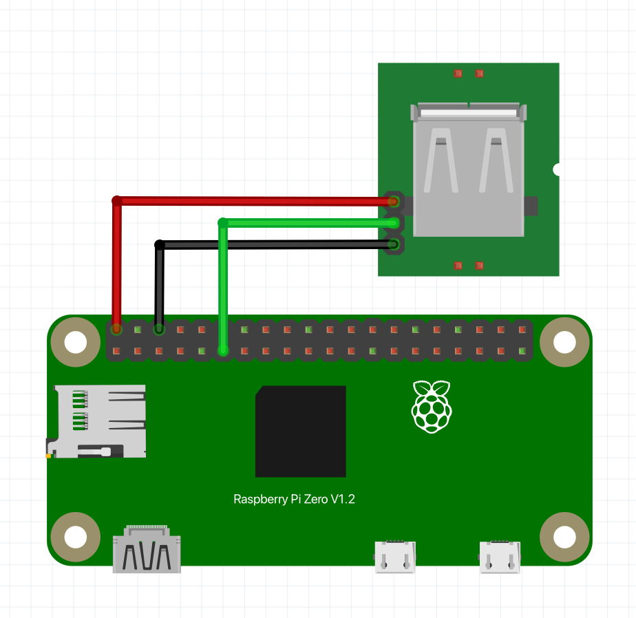

# Personal Morse Messenger

A miniature device and CLI tool to display Morse Code messages via a USB powered lamp.

### Hardware
* Raspberry Pi Zero W
* USB Power Switch Module
* 3d printed case
* Jumping wire
* Usb powered lamp

##### Schematic


### Software
1. Download Personal Morse Messenger
```
git clone https://github.com/dr-mod/personal-morse-messenger.git
```
2. Open the directory with the source code
```
cd personal-morse-messenger
```
3. Run a test command
```
python3 morse.py "Hello, world!"
```

### Case 
A 3d printable case for this project can be found [here](https://www.printables.com/social/306904-dmytro-panin/models).

### Support the project
If you would like to support what I do and keep me caffeinated, you can do it here:

[](https://www.buymeacoffee.com/drmod)
